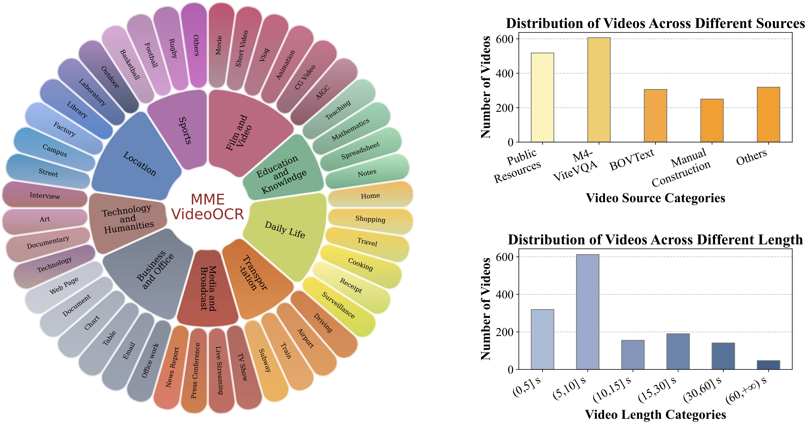

<div align="center">

</div>

# MME-VideoOCR: Evaluating OCR-Based Capabilities of Multimodal LLMs in Video Scenarios

<div align="center">

**Project Page:** [](https://mme-videoocr.github.io/) &nbsp;&nbsp;&nbsp; **arXiv Paper:** [](https://arxiv.org/pdf/) &nbsp;&nbsp;&nbsp; **Dataset:** [](https://huggingface.co/datasets/DogNeverSleep/MME-VideoOCR_Dataset)

</div>

## 📢 News
- **[2025/05/28]** We are proud to introduce **MME-VideoOCR**, a comprehensive benchmark designed to evaluate MLLMs' OCR-based capabilities in video scenarios. 🎉 Our benchmark includes:
    - **A Multi-Dimensional Task Suite**. We design 10 task categories encompassing 25 fine-grained tasks that assess a wide range of capabilities, such as text recognition, multi-frame information integration and special-format text parsing.
    - **A Rich and Diverse Dataset**. MME-VideoOCR comprises 1,464 carefully selected videos spanning 44 diverse scenarios, accompanied by 2,000 manually annotated QA pairs.
    - **Extensive Model Experiments**. We evaluate 18 state-of-the-art MLLMs, including GPT-4o, Gemini-2.5 Pro and open-source models from 7B to 78B parameters.

## 🔍 Benchmark Overview



The task requires the MLLM to first recognize the textual information distributed across multiple video frames, and then to perform semantic understanding and reasoning over the extracted text to accurately determine the correct answer. The correct information is marked in <span style="color:#0070C0;">blue</span>, while misleading information is marked in <span style="color:#C00000;">red</span>.

## 💡 Representive Examples of Each Task


## ✨ Evaluation Pipeline
We support two evaluation methods: **manual evaluation** and **automated evaluation** via the [llms-eval](https://github.com/EvolvingLMMs-Lab/lmms-eval) framework.

First, please download the video files from our [Hugging Face repository](https://huggingface.co/datasets/DogNeverSleep/MME-VideoOCR_Dataset/tree/main) to your local path.

### 📍 Manual Evaluation


### 📍 Automated Evaluation via lmms-eval
The evaluation code of MME-VideoOCR can be found in:
```
MME-VideoOCR/evaluation/lmms-eval/mme_videoocr
```
Replace `LOCAL_VIDEO_PATH` in `utils.py` with the path to your local video folder.

Then, place the `mme_videoocr` folder into the `lmms_eval/tasks` directory in [llms-eval](https://github.com/EvolvingLMMs-Lab/lmms-eval). The structure should look like this:
```
lmms_eval
├── lmms_eval
│   ├── tasks
│   │   ├── mme_videoocr
│   │   │   ├── mme_videoocr.yaml
│   │   │   ├── utils.py
```
Next, you can use the evaluation script provided by `lmms-eval` to run the benchmark. For example:
```
accelerate launch --num_processes 8 --main_process_port 12345 -m lmms_eval \
    --model llava_vid \
    --model_args pretrained=lmms-lab/LLaVA-NeXT-Video-32B-Qwen,conv_template=qwen_1_5,video_decode_backend=decord,max_frames_num=32,mm_spatial_pool_mode=average,mm_newline_position=grid,mm_resampler_location=after \
    --tasks mme_videoocr \
    --batch_size 1 \
    --log_samples \
    --log_samples_suffix llava_vid_32B \
    --output_path ./logs/
```

## 🔖 Dataset License
**License:**
```
MME-VideoOCR is only used for academic research. Commercial use in any form is prohibited.
The copyright of all videos belongs to the video owners.
If there is any infringement in MME-VideoOCR, please email frankyang1517@gmail.com and we will remove it immediately.
Without prior approval, you cannot distribute, publish, copy, disseminate, or modify MME-VideoOCR in whole or in part. 
You must strictly comply with the above restrictions.
```
Please send an email to <u>frankyang1517@gmail.com</u>. 🌟

## 📚 Citation
```bibtex
@misc{
}
```

## 🔗 Related Works
- **[MME]** [MME: A Comprehensive Evaluation Benchmark for Multimodal Large Language Models](https://github.com/BradyFU/Awesome-Multimodal-Large-Language-Models/tree/Evaluation)
- **[Video-MME]** [Could Your Multimodal LLM Challenge High-Resolution Real-World Scenarios that are Difficult for Humans?](https://github.com/MME-Benchmarks/Video-MME)
- **[MME-RealWorld]** [Could Your Multimodal LLM Challenge High-Resolution Real-World Scenarios that are Difficult for Humans?](https://mme-realworld.github.io/)
- **[MME-Survey]** [MME-Survey: A Comprehensive Survey on Evaluation of Multimodal LLMs](https://arxiv.org/abs/2411.15296)